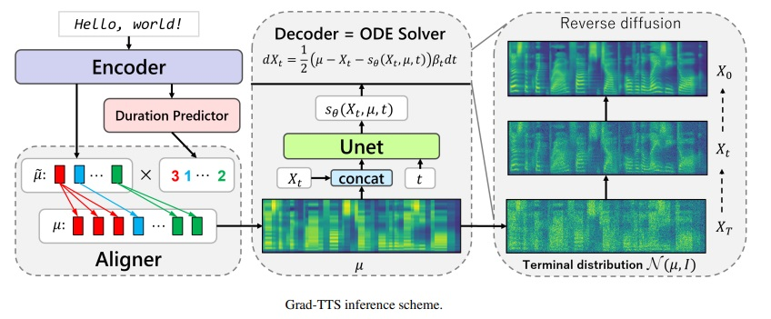
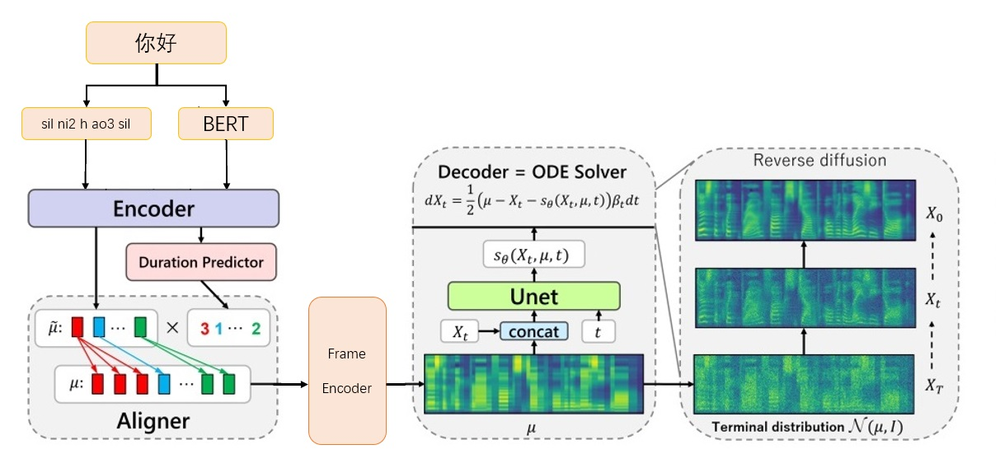

# Huawei Grad-TTS for Chinese, integrated Bert and BigVGAN

**用于学习的TTS算法项目，推理速度比较慢，但diffusion是大趋势**
<div align="center">




Framework
</div>


## 使用已训练模型测试

1. 从 [NVIDIA/BigVGAN]( https://github.com/NVIDIA/BigVGAN) 下载声码器模型 [bigvgan_base_24khz_100band](https://drive.google.com/drive/folders/1e9wdM29d-t3EHUpBb8T4dcHrkYGAXTgq) 

	将 [g_05000000]() 放到 ./bigvgan_pretrain/g_05000000

2. 从 [Executedone/Chinese-FastSpeech2](https://github.com/Executedone/Chinese-FastSpeech2) 下载BERT韵律模型 [prosody_model](https://github.com/Executedone/Chinese-FastSpeech2)

	将 best_model.pt 改名为 prosody_model.pt，并放到 ./bert/prosody_model.pt

3. 从Release页面下载TTS模型 [grad_tts.pt](https://github.com/PlayVoice/Grad-TTS-Chinese/releases/tag/release) from release page

	将 [grad_tts.pt]() 放到当前目录，或者任意地方

4. 安装环境依赖

	> pip install -r requirements.txt
	> cd ./grad/monotonic_align
	> python setup.py build_ext --inplace
	> cd -

5. 推理测试

	> python inference.py --file test.txt --checkpoint grad_tts.pt --timesteps 10 --temperature 1.015

	生成音频在文件夹`./inference_out`

	**`timesteps` 越大效果越好、推理时间越久；当被设置为0, 将跳过diffusion、输出FrameEncoder生成的mel谱**

	**`temperature` 决定diffusion推理添加的噪声量，需要调试出最佳值**

## 标贝数据

1. 下载 [标贝数据](https://aistudio.baidu.com/datasetdetail/36741) 官方连接: https://www.data-baker.com/data/index/TNtts/

	将 `Waves` 放到 ./data/Waves

	将 `000001-010000.txt` 放到 ./data/000001-010000.txt

2. 重采样到24KHz，因为采用BigVGAN 24K模型

	> python tools/preprocess_a.py -w ./data/Wave/ -o ./data/wavs -s `24000`

3. 提取mel谱，替换声码器需注意，mel参数写死在代码中

	> python tools/preprocess_m.py --wav data/wavs/ --out data/mels/

4. 提取BERT韵律向量，同时生成训练索引文件 `train.txt` 和 `valid.txt`

	> python tools/preprocess_b.py

	输出包括 `data/berts/` 和 `data/files`

	注意：打印信息，是在剔除`儿化音`（项目为算法演示，不做生产）

5. 额外说明

	原始标注为
	``` c
	000001	卡尔普#2陪外孙#1玩滑梯#4。
		ka2 er2 pu3 pei2 wai4 sun1 wan2 hua2 ti1
	000002	假语村言#2别再#1拥抱我#4。
		jia2 yu3 cun1 yan2 bie2 zai4 yong1 bao4 wo3
	```

	需要标注为，BERT需要汉字 `卡尔普陪外孙玩滑梯。` (包括标点)，TTS需要声韵母 `sil k a2 ^ er2 p u3 p ei2 ^ uai4 s uen1 ^ uan2 h ua2 t i1 sp sil`
	``` c
	000001	卡尔普陪外孙玩滑梯。
		ka2 er2 pu3 pei2 wai4 sun1 wan2 hua2 ti1
		sil k a2 ^ er2 p u3 p ei2 ^ uai4 s uen1 ^ uan2 h ua2 t i1 sp sil
	000002	假语村言别再拥抱我。
		jia2 yu3 cun1 yan2 bie2 zai4 yong1 bao4 wo3
		sil j ia2 ^ v3 c uen1 ^ ian2 b ie2 z ai4 ^ iong1 b ao4 ^ uo3 sp sil
	```

	训练标注为
	```
	./data/wavs/000001.wav|./data/mels/000001.pt|./data/berts/000001.npy|sil k a2 ^ er2 p u3 p ei2 ^ uai4 s uen1 ^ uan2 h ua2 t i1 sp sil
	./data/wavs/000002.wav|./data/mels/000002.pt|./data/berts/000002.npy|sil j ia2 ^ v3 c uen1 ^ ian2 b ie2 z ai4 ^ iong1 b ao4 ^ uo3 sp sil
	```

	遇到这句话会出错
	```
	002365	这图#2难不成#2是#1Ｐ过的#4？
		zhe4 tu2 nan2 bu4 cheng2 shi4 P IY1 guo4 de5
	```

## 训练

1. 调试dataset

	> python tools/preprocess_d.py

2. 启动训练

	> python train.py

3. 恢复训练

	> python train.py -p logs/new_exp/grad_tts_***.pt

## 推理

> python inference.py --file test.txt --checkpoint ./logs/new_exp/grad_tts_***.pt --timesteps 20 --temperature 1.15

## 本项目基于以下项目

https://github.com/huawei-noah/Speech-Backbones/blob/main/Grad-TTS

https://github.com/thuhcsi/LightGrad

https://github.com/Executedone/Chinese-FastSpeech2

https://github.com/PlayVoice/vits_chinese

https://github.com/NVIDIA/BigVGAN

# Grad-TTS官方信息

Official implementation of the Grad-TTS model based on Diffusion Probabilistic Modelling. For all details check out our paper accepted to ICML 2021 via [this](https://arxiv.org/abs/2105.06337) link.

**Authors**: Vadim Popov\*, Ivan Vovk\*, Vladimir Gogoryan, Tasnima Sadekova, Mikhail Kudinov.

<sup>\*Equal contribution.</sup>

## Abstract

**Demo page** with voiced abstract: [link](https://grad-tts.github.io/).

Recently, denoising diffusion probabilistic models and generative score matching have shown high potential in modelling complex data distributions while stochastic calculus has provided a unified point of view on these techniques allowing for flexible inference schemes. In this paper we introduce Grad-TTS, a novel text-to-speech model with score-based decoder producing mel-spectrograms by gradually transforming noise predicted by encoder and aligned with text input by means of Monotonic Alignment Search. The framework of stochastic differential equations helps us to generalize conventional diffusion probabilistic models to the case of reconstructing data from noise with different parameters and allows to make this reconstruction flexible by explicitly controlling trade-off between sound quality and inference speed. Subjective human evaluation shows that Grad-TTS is competitive with state-of-the-art text-to-speech approaches in terms of Mean Opinion Score.

## References

* HiFi-GAN model is used as vocoder, official github repository: [link](https://github.com/jik876/hifi-gan).
* Monotonic Alignment Search algorithm is used for unsupervised duration modelling, official github repository: [link](https://github.com/jaywalnut310/glow-tts).
* Phonemization utilizes CMUdict, official github repository: [link](https://github.com/cmusphinx/cmudict).


# BigVGAN 官方信息

### BigVGAN: A Universal Neural Vocoder with Large-Scale Training
#### Sang-gil Lee, Wei Ping, Boris Ginsburg, Bryan Catanzaro, Sungroh Yoon

<center></center>

project link: https://github.com/NVIDIA/BigVGAN

### Infer Test

dowdload pretrain model [bigvgan_base_24khz_100band](https://drive.google.com/drive/folders/19WyD7wN3BeIwBtr9ei1bBcdNEuiq_Avr)

```shell
python bigvgan/inference.py \
--input_wavs_dir bigvgan_debug \
--output_dir bigvgan_out
```

## Train with baker

> python bigvgan/train.py --config bigvgan_pretrain/config.json

## References
* [HiFi-GAN](https://github.com/jik876/hifi-gan) (for generator and multi-period discriminator)

* [Snake](https://github.com/EdwardDixon/snake) (for periodic activation)

* [Alias-free-torch](https://github.com/junjun3518/alias-free-torch) (for anti-aliasing)

* [Julius](https://github.com/adefossez/julius) (for low-pass filter)

* [UnivNet](https://github.com/mindslab-ai/univnet) (for multi-resolution discriminator)
